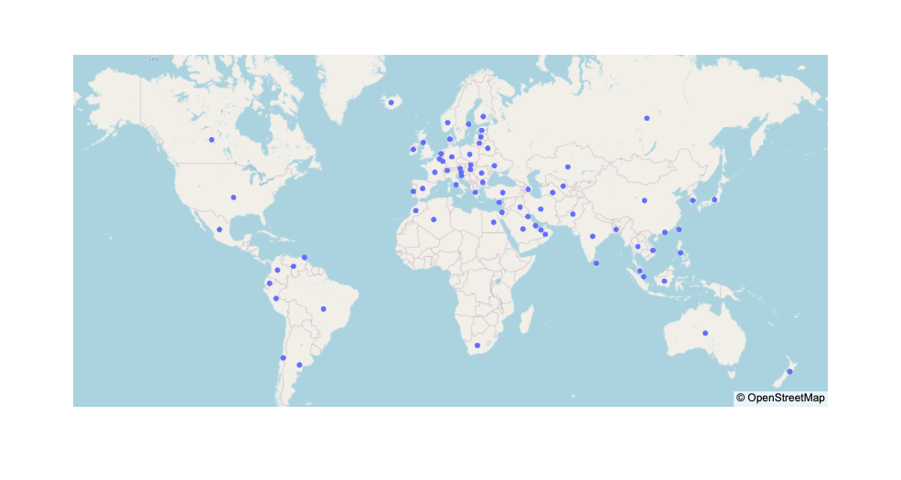

# Milestone 1

## Dataset(s)

This project will be based on worldwide energy data that can be found on [Kaggle](https://www.kaggle.com/datasets/pralabhpoudel/world-energy-consumption). Also, it will be completed by a [second dataset](https://github.com/albertyw/avenews/blob/master/old/data/average-latitude-longitude-countries.csv) that contains the longitude and latitude of every country as this may be useful for creating map visualizations. We will therefore work with a time series dataset, that contains information about energy generation and consumption from 1900 to 2020 for every country. Additional data comprises the `population` and `gdp` .

In total, there are 120 columns, but we will extract only the relevant ones, based on the different topics that will be addressed. For example, we are going to use the data on consumption and electricity for different sources of energy, and in particular we will focus more on renewables.

## Problematic

As populations increase and people get richer, the demand for energy across many countries in the world is growing. As a consequence, global energy consumption will continue to grow year after year if this increased demand is not offset by energy efficiency improvements in other sectors. This growth makes it more difficult to transition our energy systems from fossil fuels to low-carbon energy sources since energy produced from low carbon sources must meet this increased demand and attempt to replace existing fossil fuels in the energy mix.

The goal of our visualisation is to discuss if the energy transition is on its way to becoming *clean* and therefore to reduce the amount of carbon emissions. First, we would like to compare the primary energy consumption that comes from the renewables (hydro, solar, wind) and fossils (gas, coal, oil). Then, we would like to show the reader the global renewable energy growth that has been happening during the past few decades on an animated map, but also show him/her country-wise details on demand. Furthermore, it would be interesting to get an insight about the pioneers in this clean energy revolution by looking at the green electricity generation during all these years. 

The target audience is everyone interested in energy generation and consumption, especially those keen on *renewable* power.

## Exploratory Data Analysis

The exploratory data analysis was done using the pandas python library and can be found in [this](https://github.com/com-480-data-visualization/datavis-project-2022-glm/blob/main/eda/Exploratory_Data_Analysis.ipynb) jupyter notebook.

In total, there are 204 countries in the dataset, but data we are interested in is not available for each of them (see number of NaNs for each column below).

| Column_name            | Nr_NaNs |
|------------------------|---------|
| hydro_electricity      | 9642    |
| solar_electricity      | 9642    |
| wind_electricity       | 9642    |
| biofuel_electricity    | 10787   |       
| renewables_electricity | 9642    |
| renewables_consumption | 10909   |
| hydro_consumption      | 10909   |
| solar_consumption      | 10909   |
| wind_consumption       | 10909   |
| biofuel_consumption    | 9697    |

In the notebook, we have found that data related to *electricity* is available for 77 countries plotted as dots on the map below. It can be noticed that data is missing for most of the countries in Africa as well as most of the islands. This is due to the fact that, in poorer countries, commercially-traded energy sources (such as coal, oil, gas, or grid electricity) is used in smaller quantities than traditional biomass (such as crop residues and wood) which is difficult to quantify. However, the data available should suffice for our visualisations as we are planning to include only the top pioneers and these countries are likely to be situated in Europe/Americas.

As for the *consumption* data, only 2 countries do not have any entries. The missing entries are due to the fact that most of the countires only have 20 out of 121 years of *consumption* data available.

## Related Work

Obviously, energy consumption and production gets a lot of attention because of its environmental impacts. However, most visualizations are dry and static since they most often appear in scientific contexts such as [here](https://www.frontiersin.org/articles/10.3389/fenrg.2016.00033/full) and [here](https://ec.europa.eu/eurostat/cache/infographs/energy_dashboard/endash.html?geo=EU27_2020&year=2020&language=EN&detail=1&nrg_bal=&unit=MTOE&chart=chart_one,chart_two,chart_tree,chart_four,chart_five,chart_eight&modal=0), with some [exceptions](https://us-sankey.rcc.uchicago.edu).

There are two notebooks attached to this dataset on [Kaggle](https://www.kaggle.com/datasets/pralabhpoudel/world-energy-consumption/code).

The two notebooks show some basic results from the dataset. They both perform analyses on the data and compute some statistics, but these statistics are presented on static plots and graphs. Our idea is to create a more detailed and interactive visualization of the data, and also to show the evolution up to today.

There are a lot of statistics on the energy consumption by country, but we would like to show the evolution as we have data over 20 years.

Additionally, the source of the data is [Our World in Data](https://ourworldindata.org/energy-production-consumption), and there are some visualizations on there too, however the plots aren't very interactive.

Some sources of inspiration are:
- [Renewable Electricity Generation evolution](https://engaging-data.com/us-electricity-coal-renewables/): a time series plot allowing to zoom in (using [brush](https://github.com/d3/d3-brush) maybe?)
- [Wealth distribution](https://engaging-data.com/how-much-wealth-do-the-worlds-richest-billionaires-have/): an interactive treemap
